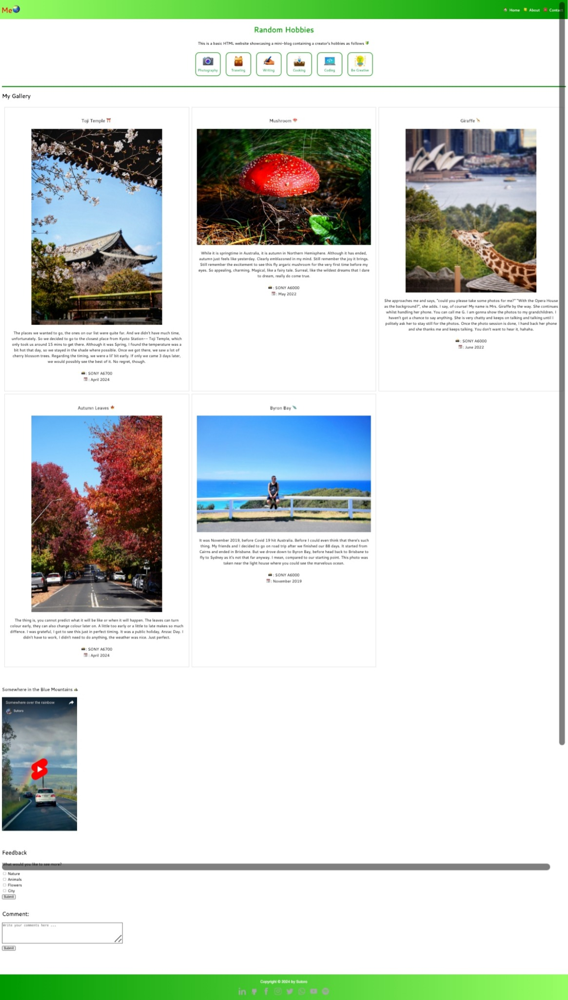

# MiniBlog - A Simple Blog Website
This is a basic HTML website prohect showcasing a mini-blog with a focus on photos, short videos, and travel experiences. It is built with basic HTML layout for responsive website, ensuring the use of appropriate tags for a well-structured foundation. Add content that fits the topic and create a form with text boxes, a big text box, a button to submit, and checkboxes to make it more interactive and useful for users.

## Features

- **Responsive Layout**: The gallery items adjust based on the screen width.
- **Google Fonts**: Uses the Cantarell font from Google Fonts.
- **Navigation Menu**: Links to Home, About Us, and Contact Us pages.
- **Gallery Section**: Displays images with descriptions.
- **Embedded Video**: A YouTube video embedded in the page.
- **Feedback Section**: Allows users to select what they want to see more and provide comments.

## HTML Tags used in this project

### HTML Boilerplate

- The `<!DOCTYPE html>` declaration is essential for rendering HTML5 elements correctly in browsers.
  
- The `<html>` tag serves as the root of the HTML document, containing the head and body tags, and supports the `lang` attribute to specify the document's language, enhancing accessibility and SEO.

- The `<head>` tag contains metadata like meta tags, title tags, link tags, scripts, and stylesheets, which are crucial for SEO and user experience but not visible on the page.

- The `<meta>` tag provides additional metadata to help search engines and social platforms understand and display the website content. Examples include:
  - `<meta charset="UTF-8">`
  - `<meta name="viewport" content="width=device-width, initial-scale=1.0">`
  - `<meta name="description" content="MiniBlog - A basic HTML website showcasing a mini-blog with a focus on photos, short videos, and travel experiences.">`
  - `<meta name="keywords" content="MiniBlog, blog, photos, travel, videos, gallery">`
  - `<meta name="author" content="Sutoro">`
  - `<meta property="og:title" content="MiniBlog">`
  - `<meta property="og:description" content="A basic HTML website showcasing a mini-blog with a focus on photos, short videos, and travel experiences.">`
  - `<meta property="og:image" content="images/header.jpeg">`
  - `<meta property="og:url" content="http://instagram.com/sutorodw">`

- The `<link>` tag is used to establish relationships with other documents, typically for linking stylesheets or pre-defined relationships.
  - `<link rel="stylesheet" href="https://fonts.googleapis.com/css2?family=Cantarell:wght@400;700&display=swap">`

- The `<style>` tag contains CSS to style the HTML elements within the document.

- The `<title>` tag defines the browser title bar text, representing the webpage's title.
  - `<title>MiniBlog</title>`

### HTML Tags for Content

- The `<body>` tag encompasses all visible webpage content, although it can also include non-visible elements like scripts and styles.

- The `<header>` tag represents introductory content or a set of navigational links.
  - `<header>`
  - ``

- The `<nav>` tag defines a set of navigation links.
  - `<nav>`
  - `<a href="/index.html" style="text-align: right;"><b>🏠 Home</b></a> |`
  - `<a href="/about/index.html" style="text-align: right;"><b>📒 About Us</b></a> |`
  - `<a href="/contact/index.html" style="text-align: right;"><b>☎️ Contact Us</b></a>`

- The `
` tag represents a thematic break between paragraph-level elements.

- The `<h1>` tag is utilized for the primary heading of the webpage.
  - `<h1 style="color: #0066ff; background-color: #b3daff; text-align: center;">Mini Blog</h1>`

- The `
` tag is used for paragraphs of text.
  - `
This is a basic HTML website showcasing a mini-blog with a focus on photos, short videos, and travel experiences.
`

- The `<h2>` tag is used for subheadings.
  - `<h2>My Gallery</h2>`

- The `
` tag is a container for other HTML elements, typically used for grouping and styling purposes.
  - `
`
  - `
`

- The `<h3>` tag is used for sub-subheadings.
  - `<h3>Toji Temple ⛩️</h3>`

- The `` tag is used to embed images.
  - ``

- The `<iframe>` tag is used to embed another HTML page within the current page.
  - `<iframe width="316" height="562" src="https://www.youtube.com/embed/vSI0GVPcKcE" title="Somewhere over the rainbow" frameborder="0" allow="accelerometer; autoplay; clipboard-write; encrypted-media; gyroscope; picture-in-picture; web-share" referrerpolicy="strict-origin-when-cross-origin" allowfullscreen></iframe>`

- The `<form>` tag is used to create an HTML form for user input.
  - `<form action="/action_page.php">`

- The `<input>` tag is used to create interactive controls in an HTML form.
  - `<input type="checkbox" id="nature" name="nature" value="Nature">`

- The `<label>` tag defines a label for an input element.
  - `<label for="nature">Nature</label>`

- The `<textarea>` tag is used to create a multi-line text input.
  - `<textarea id="comments" name="comments" rows="5" cols="60" placeholder="Write your comments here ..." maxlength="500" required></textarea>`

- The `<footer>` tag defines a footer for a document or section.
  - `<footer style="background-color: #ffb3b3; text-align: center;" >`
  - `
Created by: Sutoro
`

## Screenshot
